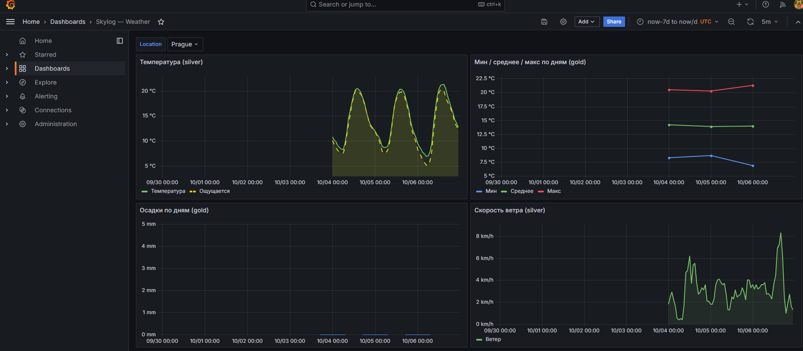
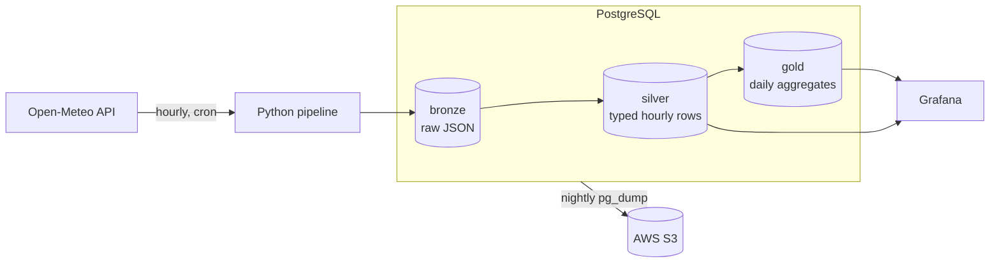

# skylog

An end-to-end data pipeline that collects hourly weather data for Prague, Kyiv and Miami from the [Open-Meteo API](https://open-meteo.com/), models it with a **medallion architecture** (bronze → silver → gold) in PostgreSQL, and visualizes it in Grafana. Fully containerized, deployed to AWS EC2 with CI/CD, and backed up nightly to S3 — running on free-tier resources.



## Architecture



| Layer | Table | What it holds |
|---|---|---|
| Bronze | `bronze.weather_raw` | The full API response as JSONB, one row per city per run. Immutable, so any downstream layer can be rebuilt. |
| Silver | `silver.weather` | Cleaned, typed hourly records (temperature, humidity, wind, precipitation, WMO weather code). Upserted on `(location, measured_at)`. |
| Gold | `gold.weather_daily` | Daily avg/min/max temperature, precipitation sum, wind and humidity per city. Recomputed for the last 3 days on every run. |

## Tech stack

- **Python 3.12** (`requests`, `psycopg2`), scheduled with **cron** inside the container
- **PostgreSQL 16**, **Grafana OSS 13** (datasource and dashboard provisioned as code)
- **Docker Compose** — three services with healthchecks and restart policies
- **GitHub Actions** — builds the image, pushes it to Docker Hub, deploys over SSH
- **AWS** — EC2 (t2.micro, 1 GB RAM + swap), S3 for backups

## Engineering decisions

- **Idempotent runs.** Silver and gold use `INSERT ... ON CONFLICT DO UPDATE`, so re-running never duplicates data and forecast hours get refined by later runs.
- **Self-healing backfill.** Each run requests yesterday + today (`past_days=1`), so a missed run doesn't leave a gap, and gold re-aggregates the last 3 days.
- **UTC everywhere.** The API is queried with `timezone=UTC` and the DB session is pinned to UTC, avoiding the classic local-time-stored-as-UTC shift.
- **Resilient API calls.** Timeouts, connection errors and transient 5xx/429 responses are retried with exponential backoff (2 s, 4 s, 8 s); permanent errors such as 404 fail immediately.
- **Failure isolation.** One city failing doesn't stop the others; the run still exits with an error so it is visible in the logs.
- **Production-aware Docker setup.** `depends_on` with `service_healthy`, cron environment explicitly exported (cron doesn't inherit container env), logs routed to `docker compose logs`.
- **Small-server tuning.** PostgreSQL `shared_buffers`/`work_mem` capped, 1 GB swap added, and the image is built in CI instead of on the 1 GB server (a prod compose override swaps `build` for `image`).
- **Backups.** Nightly `pg_dump | gzip` to S3 via cron with a 30-day lifecycle rule. A dump was verified by reading it back from S3 (all three schemas and their data present).
- **Least privilege.** Grafana connects as a dedicated `grafana_ro` role (read-only, no access to raw bronze payloads), not as the database owner. The EC2 instance reaches S3 through an IAM role scoped to a single bucket, so no AWS keys are stored on the server.
- **Secrets stay out of git.** `.env` is ignored; CI uses GitHub Secrets; the server pulls code through a read-only deploy key.
- **Supply-chain hygiene.** GitHub Actions are pinned to commit SHAs with read-only workflow permissions, and Dependabot tracks Actions, Docker images and Python dependencies. PostgreSQL major upgrades are excluded from auto-bumps because they need a dump/restore, not an image swap.

## Run locally

Requires Docker with Compose.

```bash
cp .env.example .env     # fill in the values (avoid @ : / # % in passwords)
docker compose up -d --build
bash scripts/create-grafana-ro.sh   # creates the read-only role Grafana uses
docker compose logs -f pipeline
```

Grafana: <http://localhost:3000> (user `admin`, password from `GRAFANA_PASSWORD`) → dashboard **Skylog — Weather**.

The pipeline runs once on start and then hourly. To add a city, append it to [`pipeline/locations.py`](pipeline/locations.py).

> The schema in `sql/init.sql` is applied only when the Postgres volume is first created. After changing it, run `docker compose down -v` (this deletes the data).

## Deployment

Pushing to `main` triggers `.github/workflows/deploy.yml`:

1. **build** — builds `pipeline/` for `linux/amd64` and pushes it to Docker Hub.
2. **deploy** — SSHs into the EC2 host, runs `git pull`, `docker compose pull`, `up -d` with `docker-compose.prod.yml`, then re-applies the read-only Grafana role (idempotent).

## Repository layout

```
├── docker-compose.yml          # postgres, grafana, pipeline
├── docker-compose.prod.yml     # prod override: pull image instead of building
├── pipeline/
│   ├── main.py                 # entry point: runs the three layers
│   ├── extract.py              # bronze: API call -> raw JSON
│   ├── transform.py            # silver: parse, type, upsert
│   ├── aggregate.py            # gold: daily aggregates
│   ├── locations.py            # list of cities
│   ├── db.py                   # connection helper (UTC session)
│   ├── entrypoint.sh           # exports env for cron, first run, starts cron
│   └── crontab                 # hourly schedule
├── sql/init.sql                # bronze / silver / gold schemas
├── grafana/provisioning/       # datasource + dashboard as code
├── scripts/backup.sh           # nightly dump to S3
├── scripts/create-grafana-ro.sh  # idempotent read-only DB role for Grafana
└── .github/                    # deploy workflow + Dependabot config
```

## Roadmap

- Alerting: Grafana alert when no new bronze rows for 2+ hours, uptime monitoring
- Daily aggregates in each city's local time zone (currently UTC days)
- Automated tests and a CI check before deploy
- HTTPS and a custom domain for the dashboard
